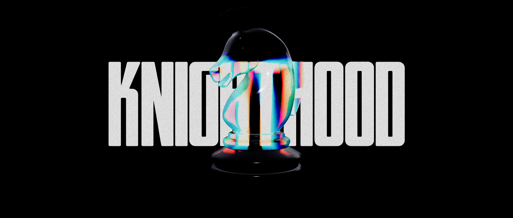

# Dispersion Chesspieces

Chesspieces created with the React-three-fiber/Three.js `MeshTransmissionMaterial`.

Live: [Dispersion Chesspieces](https://dispersion-chesspieces.vercel.app/)



## Getting Started

```bash
https://github.com/d3ttl4ff/dispersion-chesspieces.git

npm install
```

```bash
npm run dev
# or
yarn dev
# or
pnpm dev
# or
bun dev
```
